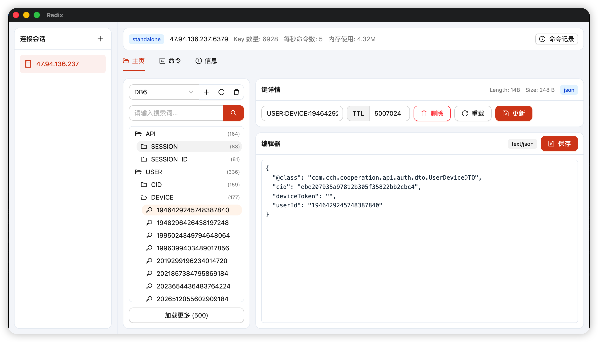
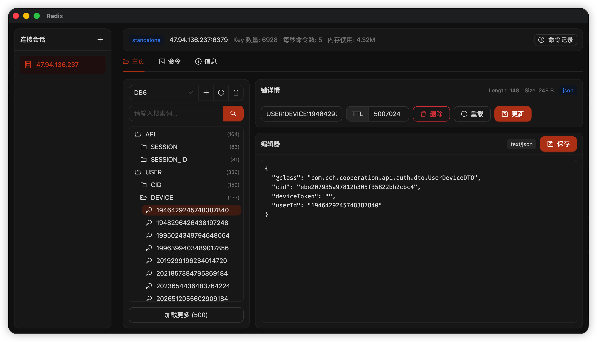
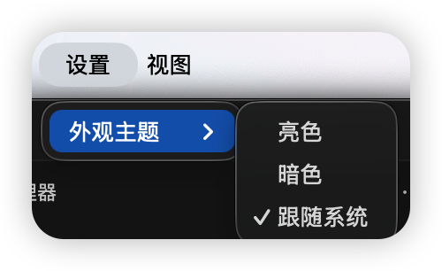

# Redix

一款现代化的跨平台 Redis GUI 客户端，基于 Electron、React 和 TypeScript 构建。


## 功能特性

- **多种部署模式支持** - 连接单机版 Redis、Redis Cluster 和 Redis Sentinel
- **SSH 隧道** - 通过 SSH 隧道安全连接，支持密码或私钥认证
- **TLS/SSL** - 完整的 TLS 支持，支持自定义 CA、证书和密码
- **数据类型管理** - 查看和编辑所有 Redis 数据类型：
  - String（支持 JSON 检测和格式化）
  - Hash
  - List
  - Set
  - Sorted Set (ZSet)
  - Stream
- **键操作** - 创建、重命名、删除键，管理 TTL
- **命令行界面** - 执行原生 Redis 命令，支持输出格式化
- **实时监控** - 监控内存使用、每秒命令数、键数量和连接客户端数
- **命令历史** - 记录所有执行的命令，包含状态和时间戳
- **连接管理** - 保存和管理多个连接配置
- **快捷键支持** - `Cmd/Ctrl+A` 新建连接，`Cmd/Ctrl+O` 打开连接管理器

## 截图

### 主界面

| 浅色模式 | 深色模式 |
|:--------:|:--------:|
|  |  |

### 主题设置



## 安装

### 环境要求

- Node.js 18+
- npm、yarn 或 pnpm

### 从源码构建

```bash
# 克隆仓库
git clone https://github.com/caichenghu/redix.git
cd redix

# 安装依赖
npm install

# 启动开发服务器
npm run dev

# 构建生产版本
npm run build

# 预览生产构建
npm run preview

# 打包应用
npm run package:mac    # macOS (arm64)
npm run package:win    # Windows (x64)
```

> **macOS 打包说明**：首次打包前需运行以下脚本生成自签名证书（每台机器只需执行一次）：
> ```bash
> bash scripts/setup-cert.sh
> npm run package:mac
> ```
> 自签名证书不受 Apple 信任，打包的应用在其他 Mac 上首次打开时会提示"无法验证开发者"，
> 右键点击应用 → **打开** 即可正常使用。](## 开发

```bash
# 开发模式运行（支持热重载）
npm run dev

# 类型检查
npm run typecheck

# 构建
npm run build
```

## 项目结构

```
redix/
├── src/
│   ├── main/                 # Electron 主进程
│   │   ├── main.ts           # 应用入口
│   │   ├── ipc.ts            # IPC 处理器
│   │   ├── redis/            # Redis 客户端逻辑
│   │   │   ├── session-service.ts
│   │   │   ├── tunnels.ts    # SSH 隧道管理
│   │   │   └── utils.ts
│   │   ├── store/            # 数据持久化
│   │   │   ├── connection-store.ts
│   │   │   └── log-store.ts
│   │   └── types/
│   ├── preload/              # 预加载脚本（IPC 桥接）
│   ├── renderer/             # React 前端
│   │   ├── src/
│   │   │   ├── components/   # UI 组件
│   │   │   ├── lib/          # 工具函数
│   │   │   ├── App.tsx       # 主应用
│   │   │   └── main.tsx      # 渲染进程入口
│   │   └── index.html
│   └── shared/               # 主进程/渲染进程共享类型
│       └── types.ts
├── resources/                # 应用资源
├── electron.vite.config.ts   # electron-vite 配置
└── package.json
```

## 技术栈

| 类别 | 技术 |
|------|------|
| 框架 | Electron 38 |
| 前端 | React 19, TypeScript 5.9 |
| UI 组件库 | Ant Design 6 |
| 构建工具 | electron-vite 5, Vite 7 |
| Redis 客户端 | ioredis 5 |
| SSH | ssh2 |

## 配置说明

### 连接配置

Redix 支持以下连接配置项：

```typescript
interface ConnectionProfile {
  id: string;
  title: string;
  topology: "standalone" | "cluster" | "sentinel";
  host: string;
  port: number;
  username?: string;
  password?: string;
  database: number;
  ssl: boolean;
  
  // 集群配置
  clusterNodes: string[];
  
  // 哨兵配置
  sentinelNodes: string[];
  sentinelName: string;
  sentinelUsername?: string;
  sentinelPassword?: string;
  
  // SSH 隧道
  ssh: {
    enabled: boolean;
    host: string;
    port: number;
    username: string;
    password?: string;
    privateKeyPath?: string;
  };
  
  // TLS 配置
  tls: {
    caPath?: string;
    certPath?: string;
    keyPath?: string;
    passphrase?: string;
  };
}
```

## 开发路线

- [ ] 深色模式支持
- [ ] 键树过滤和搜索
- [ ] 批量操作
- [ ] 数据导入/导出
- [ ] Lua 脚本编辑器
- [ ] Pub/Sub 订阅查看器
- [ ] 多语言支持

## 贡献指南

欢迎贡献代码！请随时提交 Pull Request。

1. Fork 本仓库
2. 创建功能分支 (`git checkout -b feature/amazing-feature`)
3. 提交更改 (`git commit -m 'Add some amazing feature'`)
4. 推送到分支 (`git push origin feature/amazing-feature`)
5. 创建 Pull Request

## 许可证

本项目基于 MIT 许可证开源 - 详见 [LICENSE](LICENSE) 文件。

## 致谢

- [ioredis](https://github.com/luin/ioredis) - 强大、高性能的全功能 Node.js Redis 客户端
- [Ant Design](https://ant.design/) - 企业级产品设计系统
- [electron-vite](https://electron-vite.org/) - 新一代 Electron 构建工具

---

由 [caichenghu](https://github.com/caichenghu) 开发维护
